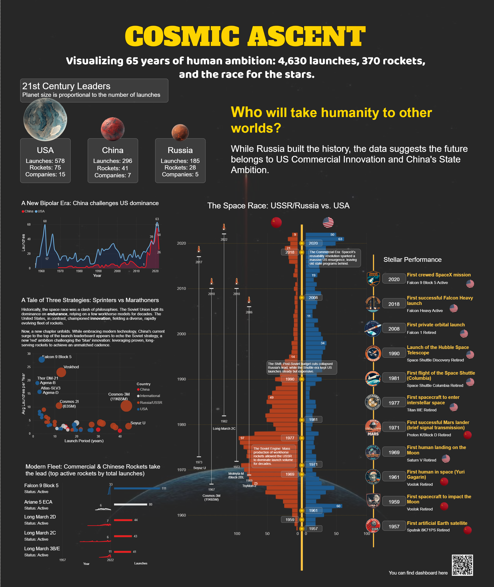

# 🚀 Cosmic Ascent: Space Missions Dashboard (1957-2022)

*(Note: Replace 'assets/dashboard-screenshot.png' with the actual path to your image if different)*

## 🔗 Links
- **Interactive Dashboard:** [INSERT LINK TO NOVYPRO/WEB HERE]
- **Portfolio Post:** [INSERT LINK TO MAVEN PORTFOLIO HERE]
- **LinkedIn:** [INSERT YOUR LINKEDIN URL]

---

## 📖 Project Overview
**"Who will take humanity to other worlds?"**

For decades, space exploration was a proxy for geopolitical dominance. This project visualizes 65 years of space history (4,630 launches) to reveal the shift from the Cold War rivalry to the modern era of commercial innovation.

**Goal:** To analyze the historical data of space missions and identify the current leaders in the global space race.

---

## 🛠️ Tools & Technologies
- **Tool:** Microsoft Power BI *(change to Tableau/Excel if needed)*
- **Data Cleaning:** Power Query / SQL
- **Visualization:** Custom Charts, Butterfly Chart, Time-series Analysis
- **Dataset:** Maven Analytics Space Missions Dataset

---

## 💡 Key Insights ("A Tale of Three Strategies")

1.  **The Soviet Workhorse:** Historically, the USSR dominated via volume (185 launches in peak years). However, post-Soviet budget cuts have significantly eroded this lead, leaving Russia with an aging fleet.
2.  **The US Commercial Pivot:** The USA successfully transitioned from government-led programs (NASA Shuttle era) to a booming commercial sector. Private companies like SpaceX have revitalized the American launch cadence.
3.  **The New Bipolar Era:** The data suggests a new rivalry is forming not between Russia and the US, but between **US Commercial Innovation** and **China's State Ambition**.

---

## 📂 Repository Structure
- `data/`: Raw dataset used for the analysis.
- `dashboard/`: The source file (.pbix/.twbx) containing the data model and visualizations.
- `assets/`: Images and resources used in this README.

---

## 📝 Author
**[Your Name]**
Data Analyst | Visualization Enthusiast

*Feel free to star ⭐ this repository if you find it useful!*
